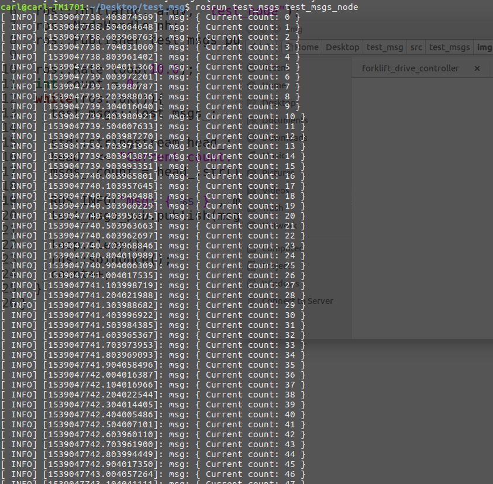
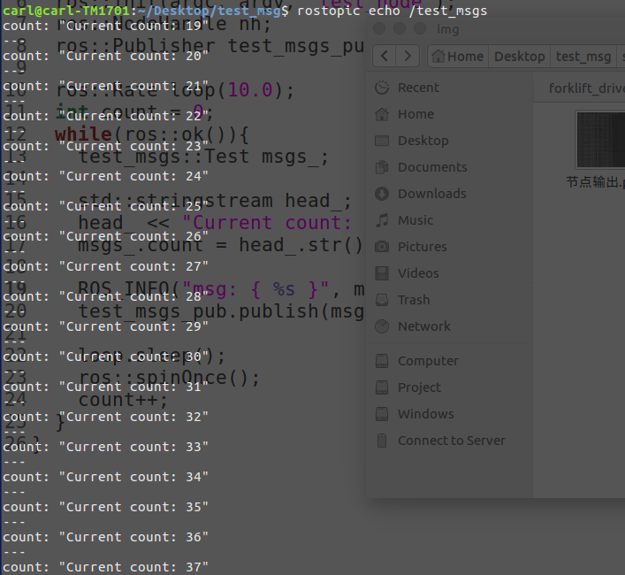

# test_msgs

Customed ros messages.

## Complie

Put this ros package into your workspace such as undering commands:
```
cd ~/catkin_ws/src
tar -zxvf test_msgs.tar.gz
cd ~/catkin_ws
catkin_make
```

After finished above command, dont forget ``source`` your workspace:
```
source ~/catkin_ws/devel/setup.bash
```

Using under command for checking:
```
echo $ROS_PACKAGE_PATH
```

this will output under context:
```
/home/carl/Desktop/test_msg/src:/home/carl/catkin_ws/src:/opt/ros/kinetic/share
```
and ```/home/carl/Desktop/test_msg/src``` is my workspace for customed message.

## Usages

Source your workspace and check ``ROS_PACKAGE_PATH`` make sure your ```test_msgs``` is under workspace, then:

Open a terminal for ROS service:
```
roscore
```

Open a terminal for ```test_msgs```:
```
rosrun test_msgs test_msgs_node
```
The output will shown as:


Open a terminal for checking out ROS topic of test_msgs node:
```
rostopic echo /test_msgs
```
The output will shown as:
 
